<h1 align="center">Hey  I'm Tushar Magar</h1>
<h3 align="center">AI Engineer | Python Developer | AI/ML Enthusiast</h3>

  

  
  
  

  

## 📌 About Me
- 🤖 As an AI Engineer, I design intelligent systems that translate complex data into practical, real-world solutions.
- 🐍 I leverage Python to architect and deploy scalable, highly efficient machine learning models.
- ✨ My ongoing exploration of generative AI pushes the boundaries of automated logic and creative problem-solving.
- 🚀 I approach every project as an opportunity to transform abstract concepts into impactful, user-centric technology.
- 💡 Driven by a commitment to continuous learning, I actively innovate to help shape the future of artificial intelligence.

## 🧠 My Focus Areas
- Artificial Intelligence & Machine Learning (AI/ML)
- Generative AI & LLMs
- AI Agents & Automation
- Full-Stack Web Development
- Computer Vision & Data Science

## 📊 GitHub Stats & Trophies

  
  

  

  

# 💻 Tech Stack:
                                                               

## 🔗 Connect with Me

  &nbsp;
  

<picture>
  <source media="(prefers-color-scheme: dark)" srcset="https://raw.githubusercontent.com/abozanona/abozanona/output/pacman-contribution-graph-dark.svg">
  <source media="(prefers-color-scheme: light)" srcset="https://raw.githubusercontent.com/abozanona/abozanona/output/pacman-contribution-graph.svg">
  
</picture>

  

